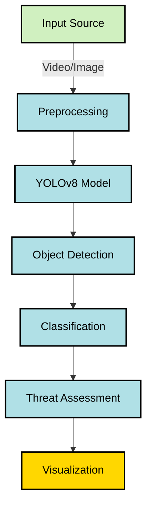

# 🛡️ Airborne Threat Detection system

A deep learning-based system designed to detect and classify airborne threats in real-time, including airplanes, drones, and helicopters. This project utilizes the YOLOv8 (You Only Look Once) object detection model for high-speed, accurate detection from aerial or ground surveillance feeds.

## 🚀 Features

- 🔍 **Real-Time Detection** of airborne threats
- 🧠 **YOLOv8-based Model** for high precision and speed
- 🎯 Supports detection of:
  - ✈️ Airplanes
  - 🚁 Helicopters
  - 🛸 Drones
- 📦 Modular codebase for easy customization
- 💻 Compatible with webcam, video files, and drone camera feeds

## 🧰 Tech Stack

- Python 🐍
- [Ultralytics YOLOv8](https://github.com/ultralytics/ultralytics)
- Streamlit
- OpenCV
- NumPy

# 📂 Project Structure

```
Airborne-Threat-Detection/
│
├── 📁 Screenshots/               # Project screenshots
│   ├── 🖼️ homepage.png
│   ├── 🖼️ image_upload.png
│   └── 🖼️ output.png
│
├── 📁 runs/detect/train
│   ├── evalutaion metrices         
│   └── 📁 weights
│         ├──  📄 best.pt         #Trained models
│         └──  📄 last.pt         
│
├── 📄 app.py                     # Streamlit app
│
├── 📄 airborne_threat_detrction.ipynb    # Code for training Yolo model
│
├── 📄 requirements.txt           # Python dependencies
│
└── 📄 README.md                  # Project documentation
```

## 🔄 Data Flow


## 🖼️ Sample Output

*Homepage*


*Image upload*
 

*YOLOv8 detecting a Helicopterin the sky.*
 


## 🛠️ Installation

```bash
# Clone the repo
git clone https://github.com/hbv3074/Airborne-Threat-Detection.git
cd Airborne-Threat-Detection

# Install dependencies
pip install -r requirements.txt
```

## 📦 Usage

### 🔍 Inference

```bash
# Run detection on image/video/webcam
python detect.py --source path/to/image_or_video --weights weights/best.pt --conf 0.5
```

### 🎓 Training (on custom dataset)

```bash
python train.py --data data.yaml --epochs 100 --weights yolov8n.pt
```

## 📁 Dataset

The model is trained on a custom dataset consisting of labeled images of:
- Airplanes
- Helicopters
- Drones

You can view the dataset using [Roboflow]([https://roboflow.com/](https://universe.roboflow.com/ahmedmohsen/drone-detection-new-peksv)) and export in YOLO format.

## 🤝 Contributing

Contributions are welcome! Feel free to open issues or submit pull requests.

## 🧑‍💻 Author

**Harsh Balkrishna Vahal**  
[GitHub](https://github.com/hbv3074) | [LinkedIn](https://www.linkedin.com/in/harsh-vahal)

## 📜 License

This project is licensed under the MIT License.

